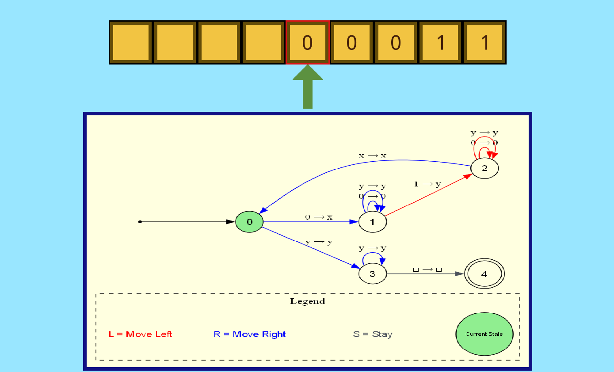
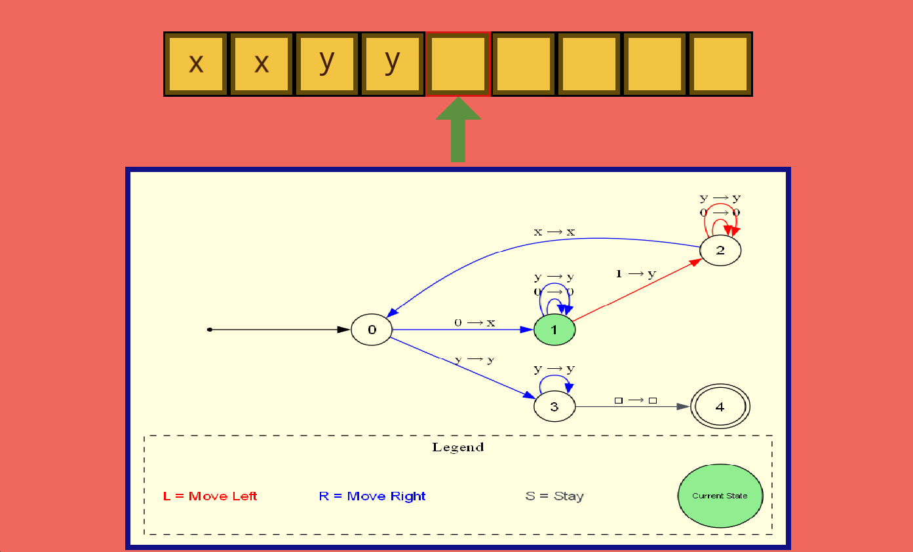
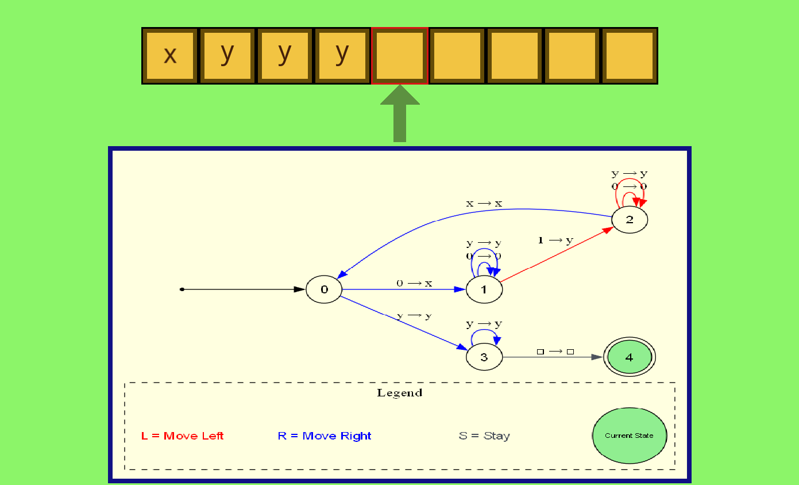

# **Turing Machine Simulator**

A C++–based Deterministic Turing Machine (DTM) simulator with SFML-based visualization and GraphViz support.

This project provides an interactive environment to **load**, **simulate**, and **visualize** Turing Machines.
It is built modularly to help students understand Automata Theory through practical implementation.

---

## **📌 Features**

* Load Turing Machine description from a text file
* Deterministic Turing Machine simulation
* Step-by-step execution
* Tape visualization and head movement
* GraphViz DOT generation for transition graphs
* Error handling for undefined transitions, invalid alphabet symbols, or badly formatted files
* SFML-based GUI components for displaying the simulation

## **🧠 Concepts Involved**

### **Turing Machine Basics**

A Turing Machine consists of:

* A finite set of states
* A tape (infinite memory)
* A head that reads/writes and moves left/right
* A transition function
* Accepting and rejecting halting states

Each transition follows the rule:

```
δ(current_state, read_symbol) → (next_state, write_symbol, direction)
```


### **Deterministic Turing Machine**

In a DTM:

* Each (state, symbol) pair has **at most one** transition
* No nondeterminism
* Simulation is predictable and linear

### **Tape Representation**

The tape is implemented using a dynamically expandable deque, allowing infinite extension on both sides.

### **Move Directions**

Supported directions:

* `L` → Left
* `R` → Right
* `S` → Stationary

### **GraphViz Diagram Generation**

The simulator exports the transition diagram as a DOT file:

* Nodes represent states
* Edges represent transitions labeled as `read/write, direction`

---

## **🧱 System Architecture**

### **`turing_machine` Class**

Handles:

* State and alphabet definitions
* Transition storage and validation
* Simulation logic
* DOT export for visualization

### **Simulation Pipeline**

1. Load machine description
2. Initialize tape with input
3. Loop through:
   * Read symbol
   * Determine next transition
   * Write symbol
   * Move head
   * Change state
   
4. Halt when:
   * Transition doesn’t exist
   
   * State is accepting
   

### **Error Handling**

The simulator checks for:

* Invalid alphabet symbols
* Conflicting transitions
* Missing or malformed transitions
* Incorrect input file format

---

## **📄 Input File Format**

A TM file contains:

```
number_of_states
input_alphabet
tape_alphabet
start_state
final_states
(current_state, read_symbol, next_state, write_symbol, direction)
...
```

Example transition:

```
0 a 1 b R
```

---

## **📊 Results**

The simulator successfully:

* Parses and validates TM files
* Simulates acceptance and rejection correctly
* Shows tape movement and state transitions
* Produces DOT graphs
* Handles invalid input gracefully

---

## **📚 Conclusion**

The Turing Machine Simulator is a complete practical demonstration of a DTM and its computational model.
It provides a strong foundation for learning Automata Theory and can be extended to:

* Nondeterministic TMs
* Multi-tape TMs
* Rich GUI visualization
* Debugging tools

---

## **🛠 Setup**

**Currently this project is supported for Windows operating system only.**

Install and setup the following :
- GCC
- CMAKE
- GRAPHVIZ
- SFML

Either add a system variable named `SFML_GCC_2.6.2_DIR` pointing to the SFML directory
**OR** modify the `CMakeLists.txt` file:

```
# replace the path below with the actual path
set(SFML_LOCAL_DIR $ENV{SFML_GCC_2.6.2_DIR})
```

Example path:
`C:/Libraries/SFML-2.6.2-windows-gcc-13.1.0-mingw-64-bit`

The folder must contain `bin`, `include`, `lib`, etc.

---

### **Build & Run**

Run these inside the project directory:

```bash
mkdir build
cd build
cmake -G "MinGW Makefiles" "-DCMAKE_TOOLCHAIN_FILE=../gcc-toolchain.cmake" -S .. -B .
cmake --build .
./simulator.exe
```

Or PowerShell one-liner:

```bash
mkdir build ; if ($?) { cd build } ; if ($?) { cmake -G "MinGW Makefiles" "-DCMAKE_TOOLCHAIN_FILE=../gcc-toolchain.cmake" -S .. -B . } ;
if ($?) { cmake --build . }; if ($?) { ./simulator.exe } ;
```

For subsequent runs:

```bash
cmake --build . ; if ($?) { ./simulator.exe };
```